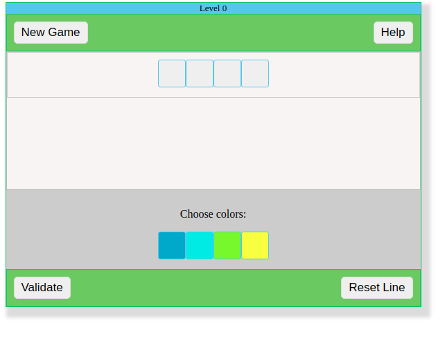

# Find the secret combination
This is a logic game written in TypeScript. 

## How It works?
At the bottom of the page you have multiple colors. Click on them to find de secret combination. After all boxes are filled, click on validate.

After validation, you will get the following information:

- Correct: This means that some colors are on the right position
- Incorrect: This means that some colors are correct, but are not on the right position.

The goal is to have all the colors on the correct positions. Once you find that, you will advance to the next level.

## Dependencies
 - jQuery
  
## Init game
In order to embed this Game into your page, you need to add the following script:
```html
    <div id="main_game"></div>
    <script type="text/javascript">
        var Game = new Game(4);
        Game.withJQuery($).start();
    </script>
```

The value `4` means that the game will render `4 blocks` for the first level.

Inside the id "main_game" the game will be rendered.

Also, this script uses a `style.css` that makes the UI pretty.

After each level, the number of block will increase with one.

## Screenshot


## Live demo
You can see a live demo for this game [here](https://projects.mngzone.com/blocks?utm_source=github).

